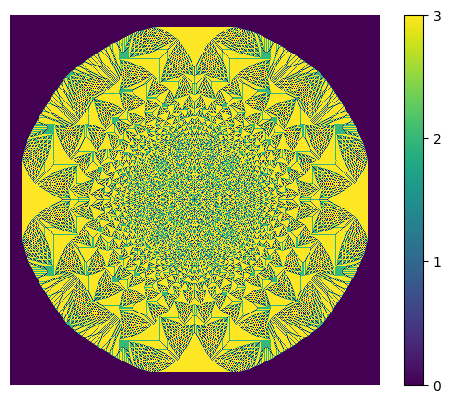
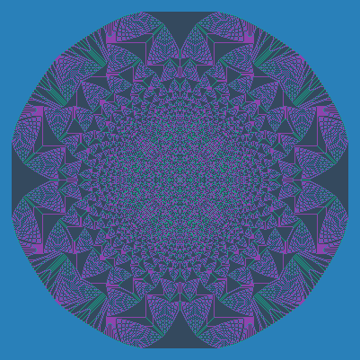
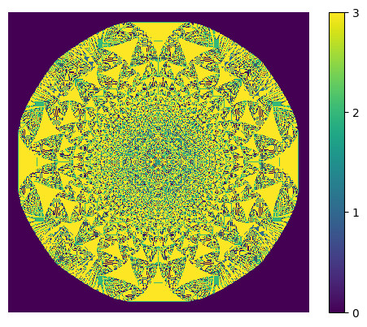
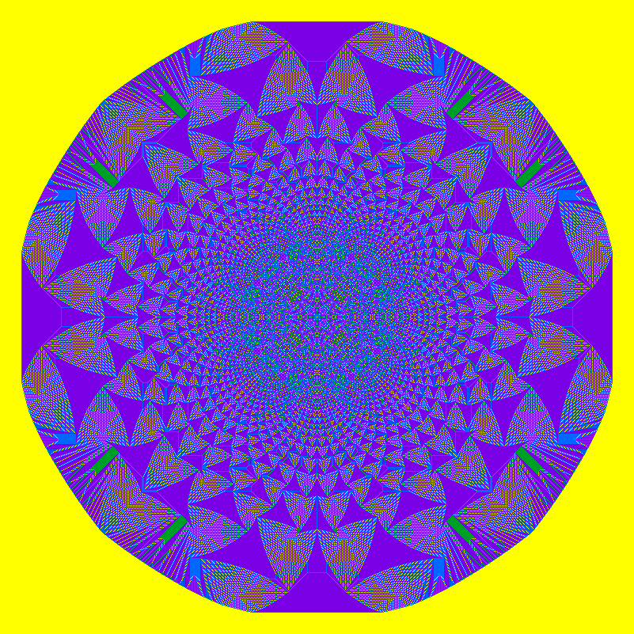

# <p align = "center"> Sandpile </p>
---

<p align = "center"> Python implementation of the Sandpile Model </p>

-   [Required packages](#required_packages)
-   [Usage](#usage)
    + [Program example](#program_example)
-   [Examples](#examples)
    + [2^18 grains](#2^18_grains)
    + [2^20 grains](#2^20_grains)
---


The Abelian sandpile model, also known as the Bak–Tang–Wiesenfeld model, was the first discovered example of a dynamical system displaying self-organized criticality.

To know more read https://en.wikipedia.org/wiki/Abelian_sandpile_model

## Required packages
This module requires matplotlib, numpy and PIL to be installed.
```Bash
pip3 install matplotlib numpy Pillow
```

## Usage
To run the model, choose the simulation parameters and run the script sandpile/example.py. Important parameters are the grid size and the number of grains to be dropped.

The main model methods can be found at sandpile/sandpile.py.

##### Construct a sandpile:
```Python
from sandpile import Sandpile
pile = Sandpile(options)
```

`options` may contain:
- `rows` - height of sandpile
- `cols` - width of sandpile
- `max_sand` - max count of sandpile grains

It gives you a zero sandpile

Also you can create sandpile from array, if you give array to constructor
```Python
from sandpile import Sandpile
pile = Sandpile([[0,1,0],[1,0,1],[0,1,0]])
```

##### Add sand to sandpile:
```Python
pile.set_sand(x, y, number)
```
where `x` and `y` - coordinates of sandpile grid, `number` - count of sand grains


##### Run the model:
```Python
pile.run()
```

##### Visualisations:
If you would like to plot sandpile and show it, you can use
```Python
pile.show(options)
```
`options` may contain:
- `save` - true = if you want save picture, false = if don't want
- `filename` - name of the file, where would be picture of sandpile

If you just want to save the picture , then use
```Python
pile.save(filename)
```
where `filename` - name of the file, where would be picture of sandpile

### Program example
You can find this example in `/sandpile/example.py`

```Python
from sandpile import Sandpile

pile = Sandpile(rows = 201, cols = 201)
pile.set_sand(100, 100, 2**16)

pile.run()

pile.show(save = True, filename = "2^16 grains(1).png")
pile.save(filename = "2^16 grains(2).png")
```

## Examples

### 2^18 grains
Fractal in a 401x401 lattice created from an initial 2^18 (262144) grains in the center



### 2^20 grains
Fractal in a 801x801 lattice created from an initial 2^20 (1048576) grains in the center


